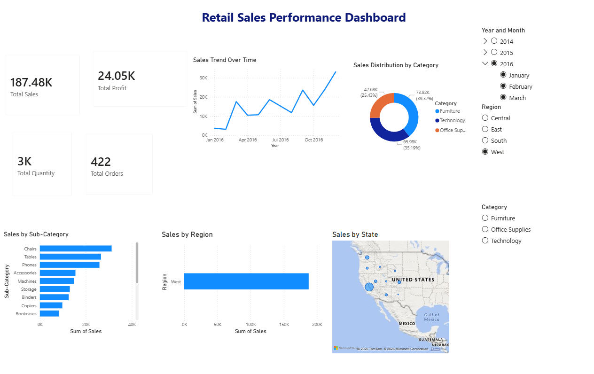
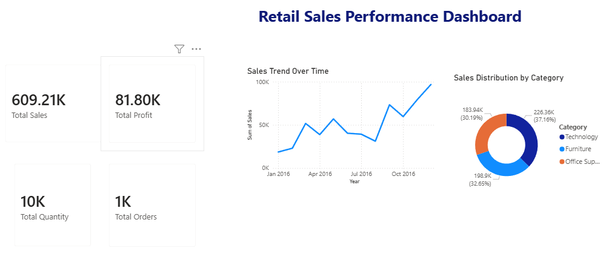
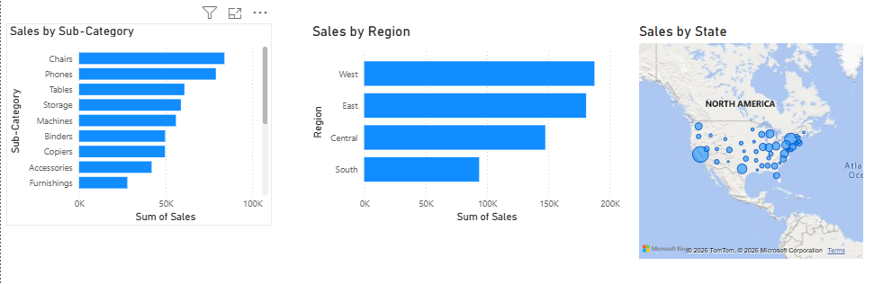

# 📊 Retail Sales Performance Dashboard

## 🚀 Overview
This project is an interactive Power BI dashboard built using retail sales data to analyze:
- Sales performance
- Profit trends
- Regional analysis
- Product category insights
- KPI tracking

---

## 📸 Dashboard Preview

### Main Dashboard

### Sales Analysis

### Regional Analysis

---

## 🛠 Tools Used
- Power BI
- DAX
- Power Query
- CSV Dataset

---

## 📈 Key Insights
- West region generated highest sales
- Technology category performed best
- Sales showed strong growth in later months

---

## 📂 Files Included
- Power BI dashboard (.pbix)
- Dataset (.csv)
- Dashboard screenshots

---

## 👨‍💻 Author
Vedant Deshmukh